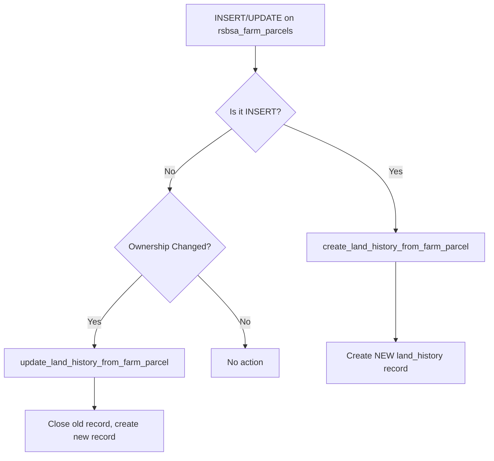

# Land History System - Complete Implementation Guide

## Table of Contents
1. [Overview](#overview)
2. [Database Schema](#database-schema)
3. [Implementation Steps](#implementation-steps)
4. [Automatic Data Sync](#automatic-data-sync)
5. [API Integration](#api-integration)
6. [Frontend Integration](#frontend-integration)
7. [Best Practices](#best-practices)

---

## Overview

The Land History System is designed to track comprehensive land ownership and tenancy records over time. It automatically captures changes from RSBSA submissions and maintains a complete audit trail of land ownership transitions.

### Key Features
✅ **Automatic History Tracking** - Triggers automatically create history records when farm parcels are added or updated  
✅ **Complete Audit Trail** - Track who owned/farmed the land, when, and why it changed  
✅ **Flexible Ownership Types** - Support for owners, tenants, lessees, and other arrangements  
✅ **Historical Queries** - Easy to query current status or complete history  
✅ **Data Integrity** - Foreign key relationships ensure data consistency  

---

## Database Schema

### Table: `land_history`

#### Core Fields

| Field | Type | Description |
|-------|------|-------------|
| `id` | BIGSERIAL | Primary key |
| `rsbsa_submission_id` | BIGINT | Links to RSBSA submission |
| `farm_parcel_id` | BIGINT | Links to specific farm parcel |
| `parcel_number` | VARCHAR(20) | Parcel identifier |
| `farm_location_barangay` | VARCHAR(100) | Barangay location |
| `farm_location_municipality` | VARCHAR(100) | Municipality location |
| `total_farm_area_ha` | DECIMAL(10,2) | Area in hectares |

#### Ownership Information

| Field | Type | Description |
|-------|------|-------------|
| `land_owner_id` | BIGINT | ID of legal land owner |
| `land_owner_name` | VARCHAR(200) | Name of legal land owner |
| `land_owner_ffrs_code` | VARCHAR(50) | FFRS code if owner is a farmer |
| `farmer_id` | BIGINT | ID of person farming the land |
| `farmer_name` | VARCHAR(200) | Name of farmer |
| `farmer_ffrs_code` | VARCHAR(50) | Farmer's FFRS code |

#### Tenancy Information

| Field | Type | Description |
|-------|------|-------------|
| `tenant_name` | VARCHAR(200) | Name if farmer is tenant |
| `is_tenant` | BOOLEAN | True if tenant arrangement |
| `lessee_name` | VARCHAR(200) | Name if farmer is lessee |
| `is_lessee` | BOOLEAN | True if lease arrangement |
| `is_registered_owner` | BOOLEAN | True if farmer owns the land |
| `is_other_ownership` | BOOLEAN | True for other arrangements |

#### Time Tracking

| Field | Type | Description |
|-------|------|-------------|
| `period_start_date` | DATE | When arrangement began |
| `period_end_date` | DATE | When it ended (NULL if current) |
| `is_current` | BOOLEAN | TRUE for active records |

#### Change Tracking

| Field | Type | Description |
|-------|------|-------------|
| `change_type` | VARCHAR(50) | NEW, OWNERSHIP_CHANGE, UPDATE, etc. |
| `change_reason` | TEXT | Reason for the change |
| `previous_record_id` | BIGINT | Link to previous history record |
| `created_at` | TIMESTAMP | When record was created |
| `created_by` | VARCHAR(100) | Who created the record |

---

## Implementation Steps

### Step 1: Create Improved Land History Table

Run the `land_history_improved.sql` script:

```sql
-- Execute in PostgreSQL
\i c:/Users/dblaz/Research-Project/database/land_history_improved.sql
```

This will:
- ✅ Create the `land_history` table with all necessary fields
- ✅ Add indexes for performance
- ✅ Create helper functions
- ✅ Set up automatic triggers for RSBSA integration

### Step 2: Migrate Existing Data

If you already have data in `rsbsa_farm_parcels`, migrate it:

```sql
-- Execute migration
\i c:/Users/dblaz/Research-Project/database/migrate_land_history.sql
```

This will:
- ✅ Populate `land_history` from existing `rsbsa_farm_parcels` data
- ✅ Set all migrated records as current (`is_current = TRUE`)
- ✅ Verify data integrity

### Step 3: Verify Installation

```sql
-- Check that everything is set up
SELECT COUNT(*) as total_history_records FROM land_history;

-- Verify triggers are active
SELECT trigger_name, event_manipulation 
FROM information_schema.triggers 
WHERE event_object_table = 'rsbsa_farm_parcels';
```

Expected triggers:
- `trigger_create_land_history_on_parcel_insert`
- `trigger_update_land_history_on_parcel_update`

---

## Automatic Data Sync

### How It Works

The system uses PostgreSQL triggers to automatically sync data:

#### 1. **When a new RSBSA farm parcel is created**

```sql
-- User creates a new farm parcel
INSERT INTO rsbsa_farm_parcels (
    submission_id,
    parcel_number,
    farm_location_barangay,
    total_farm_area_ha,
    ownership_type_tenant,
    tenant_land_owner_name
) VALUES (
    123, '1', 'San Jose', 2.5, TRUE, 'Juan dela Cruz'
);

-- TRIGGER AUTOMATICALLY CREATES land_history record
-- ✅ No manual intervention needed!
```

**What happens automatically:**
1. Trigger `create_land_history_from_farm_parcel()` fires
2. Gets farmer info from `rsbsa_submission`
3. Creates new `land_history` record
4. Sets `is_current = TRUE`
5. Sets `change_type = 'NEW'`

#### 2. **When ownership/tenancy changes**

```sql
-- User updates parcel ownership
UPDATE rsbsa_farm_parcels 
SET 
    ownership_type_tenant = FALSE,
    ownership_type_registered_owner = TRUE
WHERE id = 456;

-- TRIGGER AUTOMATICALLY:
-- 1. Marks old land_history as not current (is_current = FALSE)
-- 2. Sets period_end_date on old record
-- 3. Creates new land_history record with updated info
-- 4. Links new record to old via previous_record_id
```

**What happens automatically:**
1. Trigger `update_land_history_from_farm_parcel()` fires
2. Detects ownership change
3. Closes old history record (sets `period_end_date`)
4. Creates new history record with `change_type = 'OWNERSHIP_CHANGE'`
5. Links new to old record for audit trail

### Trigger Logic Flow



---

## API Integration

### Backend Endpoints (server.cjs)

Add these endpoints to your `backend/server.cjs`:

#### 1. Get Current Land History for a Parcel

```javascript
// Get current ownership status for a specific farm parcel
app.get('/api/land-history/parcel/:parcelId/current', async (req, res) => {
    try {
        const { parcelId } = req.params; 
        
        const result = await pool.query(`
            SELECT 
                lh.*,
                CASE 
                    WHEN lh.is_registered_owner THEN 'Owner'
                    WHEN lh.is_tenant THEN 'Tenant'
                    WHEN lh.is_lessee THEN 'Lessee'
                    ELSE 'Other'
                END as ownership_status
            FROM land_history lh
            WHERE lh.farm_parcel_id = $1
              AND lh.is_current = TRUE
        `, [parcelId]);
        
        if (result.rows.length === 0) {
            return res.status(404).json({ error: 'No current history found for this parcel' });
        }
        
        res.json(result.rows[0]);
    } catch (error) {
        console.error('Error fetching current land history:', error);
        res.status(500).json({ error: 'Failed to fetch land history' });
    }
});
```

#### 2. Get Complete History for a Parcel

```javascript
// Get complete ownership history for a parcel (for dropdown)
app.get('/api/land-history/parcel/:parcelId/history', async (req, res) => {
    try {
        const { parcelId } = req.params;
        
        const result = await pool.query(`
            SELECT 
                lh.id,
                lh.farmer_name,
                lh.farmer_ffrs_code,
                lh.land_owner_name,
                CASE 
                    WHEN lh.is_registered_owner THEN 'Owner'
                    WHEN lh.is_tenant THEN 'Tenant'
                    WHEN lh.is_lessee THEN 'Lessee'
                    ELSE 'Other'
                END as relationship_type,
                lh.period_start_date,
                lh.period_end_date,
                lh.is_current,
                CASE 
                    WHEN lh.is_current THEN 'Current'
                    ELSE 'Past'
                END as status,
                CASE 
                    WHEN lh.period_end_date IS NOT NULL THEN 
                        EXTRACT(YEAR FROM AGE(lh.period_end_date, lh.period_start_date)) || ' years'
                    ELSE 
                        EXTRACT(YEAR FROM AGE(CURRENT_DATE, lh.period_start_date)) || ' years (ongoing)'
                END as duration
            FROM land_history lh
            WHERE lh.farm_parcel_id = $1
            ORDER BY lh.is_current DESC, lh.period_start_date DESC
        `, [parcelId]);
        
        res.json(result.rows);
    } catch (error) {
        console.error('Error fetching land history:', error);
        res.status(500).json({ error: 'Failed to fetch land history' });
    }
});
```

#### 3. Get All Lands for a Specific Owner

```javascript
// Get all lands owned by a specific person
app.get('/api/land-history/owner/:ownerName', async (req, res) => {
    try {
        const { ownerName } = req.params;
        
        const result = await pool.query(`
            SELECT 
                lh.id,
                lh.parcel_number,
                lh.farm_location_barangay,
                lh.farm_location_municipality,
                lh.total_farm_area_ha,
                lh.farmer_name,
                CASE 
                    WHEN lh.farmer_name = lh.land_owner_name THEN 'Self-Farmed'
                    WHEN lh.is_tenant THEN 'Rented to Tenant'
                    WHEN lh.is_lessee THEN 'Leased to Lessee'
                    ELSE 'Other Arrangement'
                END as farming_arrangement,
                lh.period_start_date,
                lh.ownership_document_no
            FROM land_history lh
            WHERE lh.land_owner_name ILIKE $1
              AND lh.is_current = TRUE
            ORDER BY lh.farm_location_barangay, lh.parcel_number
        `, [`%${ownerName}%`]);
        
        res.json(result.rows);
    } catch (error) {
        console.error('Error fetching owner lands:', error);
        res.status(500).json({ error: 'Failed to fetch owner lands' });
    }
});
```

#### 4. Get Tenant/Lessee History Dropdown

```javascript
// Get tenant/lessee history for dropdown menu
app.get('/api/land-history/parcel/:parcelId/tenants', async (req, res) => {
    try {
        const { parcelId } = req.params;
        
        const result = await pool.query(`
            SELECT 
                lh.id,
                lh.farmer_name as name,
                lh.farmer_ffrs_code as ffrs_code,
                CASE 
                    WHEN lh.is_tenant THEN 'Tenant'
                    WHEN lh.is_lessee THEN 'Lessee'
                    ELSE 'Other'
                END as type,
                TO_CHAR(lh.period_start_date, 'YYYY-MM-DD') as start_date,
                TO_CHAR(lh.period_end_date, 'YYYY-MM-DD') as end_date,
                lh.is_current,
                CASE 
                    WHEN lh.period_end_date IS NOT NULL THEN 
                        lh.period_start_date || ' to ' || lh.period_end_date
                    ELSE 
                        lh.period_start_date || ' to Present'
                END as period_display
            FROM land_history lh
            WHERE lh.farm_parcel_id = $1
              AND (lh.is_tenant = TRUE OR lh.is_lessee = TRUE)
            ORDER BY lh.is_current DESC, lh.period_start_date DESC
        `, [parcelId]);
        
        res.json(result.rows);
    } catch (error) {
        console.error('Error fetching tenant history:', error);
        res.status(500).json({ error: 'Failed to fetch tenant history' });
    }
});
```

#### 5. Get Land Owners List

```javascript
// Get unique list of land owners
app.get('/api/land-history/owners', async (req, res) => {
    try {
        const result = await pool.query(`
            SELECT DISTINCT
                lh.land_owner_name as name,
                lh.land_owner_ffrs_code as ffrs_code,
                COUNT(DISTINCT lh.farm_parcel_id) as parcel_count,
                SUM(lh.total_farm_area_ha) as total_area_ha
            FROM land_history lh
            WHERE lh.is_current = TRUE
              AND lh.land_owner_name IS NOT NULL
            GROUP BY lh.land_owner_name, lh.land_owner_ffrs_code
            ORDER BY lh.land_owner_name
        `);
        
        res.json(result.rows);
    } catch (error) {
        console.error('Error fetching land owners:', error);
        res.status(500).json({ error: 'Failed to fetch land owners' });
    }
});
```

---

## Frontend Integration

### React Component Example: Land Owner Display with Tenant History Dropdown

Create a new component `src/components/LandOwnershipHistory.tsx`:

```typescript
import React, { useState, useEffect } from 'react';

interface TenantHistory {
    id: number;
    name: string;
    ffrs_code: string;
    type: 'Tenant' | 'Lessee' | 'Other';
    start_date: string;
    end_date: string | null;
    is_current: boolean;
    period_display: string;
}

interface LandOwnershipHistoryProps {
    parcelId: number;
}

const LandOwnershipHistory: React.FC<LandOwnershipHistoryProps> = ({ parcelId }) => {
    const [currentOwner, setCurrentOwner] = useState<any>(null);
    const [tenantHistory, setTenantHistory] = useState<TenantHistory[]>([]);
    const [selectedTenant, setSelectedTenant] = useState<number | null>(null);
    const [loading, setLoading] = useState(true);

    useEffect(() => {
        fetchOwnershipData();
    }, [parcelId]);

    const fetchOwnershipData = async () => {
        try {
            setLoading(true);
            
            // Fetch current ownership
            const currentResponse = await fetch(
                `/api/land-history/parcel/${parcelId}/current`
            );
            const currentData = await currentResponse.json();
            setCurrentOwner(currentData);

            // Fetch tenant/lessee history
            const historyResponse = await fetch(
                `/api/land-history/parcel/${parcelId}/tenants`
            );
            const historyData = await historyResponse.json();
            setTenantHistory(historyData);
            
            setLoading(false);
        } catch (error) {
            console.error('Error fetching ownership data:', error);
            setLoading(false);
        }
    };

    if (loading) {
        return <div className="loading">Loading ownership information...</div>;
    }

    if (!currentOwner) {
        return <div className="error">No ownership information found</div>;
    }

    return (
        <div className="land-ownership-history">
            <div className="current-ownership">
                <h3>Current Land Ownership</h3>
                <div className="ownership-details">
                    <div className="detail-row">
                        <label>Land Owner:</label>
                        <span>{currentOwner.land_owner_name}</span>
                    </div>
                    <div className="detail-row">
                        <label>Current Farmer:</label>
                        <span>{currentOwner.farmer_name}</span>
                    </div>
                    <div className="detail-row">
                        <label>Status:</label>
                        <span className={`status-badge ${currentOwner.ownership_status.toLowerCase()}`}>
                            {currentOwner.ownership_status}
                        </span>
                    </div>
                    <div className="detail-row">
                        <label>Since:</label>
                        <span>{new Date(currentOwner.period_start_date).toLocaleDateString()}</span>
                    </div>
                </div>
            </div>

            {tenantHistory.length > 0 && (
                <div className="tenant-history">
                    <h3>Tenant/Lessee History</h3>
                    <select 
                        className="tenant-dropdown"
                        value={selectedTenant || ''}
                        onChange={(e) => setSelectedTenant(Number(e.target.value))}
                    >
                        <option value="">Select a previous tenant/lessee...</option>
                        {tenantHistory.map((tenant) => (
                            <option key={tenant.id} value={tenant.id}>
                                {tenant.name} ({tenant.type}) - {tenant.period_display}
                                {tenant.is_current && ' - CURRENT'}
                            </option>
                        ))}
                    </select>

                    {selectedTenant && (
                        <div className="selected-tenant-details">
                            {(() => {
                                const tenant = tenantHistory.find(t => t.id === selectedTenant);
                                if (!tenant) return null;
                                
                                return (
                                    <div className="tenant-info">
                                        <h4>{tenant.name}</h4>
                                        <p><strong>Type:</strong> {tenant.type}</p>
                                        <p><strong>FFRS Code:</strong> {tenant.ffrs_code}</p>
                                        <p><strong>Period:</strong> {tenant.period_display}</p>
                                        {tenant.is_current && (
                                            <span className="current-badge">Current</span>
                                        )}
                                    </div>
                                );
                            })()}
                        </div>
                    )}
                </div>
            )}
        </div>
    );
};

export default LandOwnershipHistory;
```

### Usage Example

```typescript
// In JoLandrecords.tsx or any land records page
import LandOwnershipHistory from '../components/LandOwnershipHistory';

function JoLandrecords() {
    const [selectedParcelId, setSelectedParcelId] = useState<number | null>(null);

    return (
        <div className="land-records-page">
            {/* Your existing code */}
            
            {selectedParcelId && (
                <LandOwnershipHistory parcelId={selectedParcelId} />
            )}
        </div>
    );
}
```

---

## Best Practices

### 1. Data Integrity

✅ **Always use the triggers** - Don't manually insert into `land_history`  
✅ **Maintain referential integrity** - Ensure `rsbsa_submission` and `rsbsa_farm_parcels` exist before creating history  
✅ **Use transactions** - When updating multiple related records  

```sql
BEGIN;
    -- Update farm parcel
    UPDATE rsbsa_farm_parcels SET ...;
    -- Trigger automatically handles land_history
COMMIT;
```

### 2. Querying

✅ **Use `is_current = TRUE`** for active records  
✅ **Use indexes** - Queries on indexed fields (barangay, owner name, etc.) are fast  
✅ **Filter by date ranges** for historical analysis  

```sql
-- Good: Uses index
SELECT * FROM land_history 
WHERE is_current = TRUE AND farm_location_barangay = 'San Jose';

-- Avoid: Full table scan
SELECT * FROM land_history WHERE notes LIKE '%something%';
```

### 3. Handling Manual Changes

If you need to manually update history (e.g., correcting past data):

```sql
-- Disable triggers temporarily
ALTER TABLE rsbsa_farm_parcels DISABLE TRIGGER ALL;

-- Make your manual changes
UPDATE land_history SET ... WHERE ...;

-- Re-enable triggers
ALTER TABLE rsbsa_farm_parcels ENABLE TRIGGER ALL;
```

### 4. Performance Optimization

For large datasets:
- ✅ Regularly run `VACUUM ANALYZE land_history;`
- ✅ Monitor query performance with `EXPLAIN ANALYZE`
- ✅ Consider partitioning by year if you have millions of records

### 5. Backup and Recovery

```sql
-- Backup land_history table
pg_dump -U postgres -t land_history your_database > land_history_backup.sql

-- Restore if needed
psql -U postgres your_database < land_history_backup.sql
```

---

## Troubleshooting

### Issue: No history records created automatically

**Solution:**
```sql
-- Check if triggers are enabled
SELECT trigger_name, tgenabled 
FROM pg_trigger 
WHERE tgrelid = 'rsbsa_farm_parcels'::regclass;

-- Re-create triggers if needed
\i c:/Users/dblaz/Research-Project/database/land_history_improved.sql
```

### Issue: Duplicate history records

**Solution:**
```sql
-- Find duplicates
SELECT farm_parcel_id, COUNT(*) 
FROM land_history 
WHERE is_current = TRUE 
GROUP BY farm_parcel_id 
HAVING COUNT(*) > 1;

-- Fix: Keep most recent, mark others as not current
-- (Manual intervention needed based on your data)
```

### Issue: Missing farmer names

**Solution:**
```sql
-- Update missing names from RSBSA submissions
UPDATE land_history lh
SET farmer_name = CONCAT_WS(' ',
    rs."FIRST NAME",
    rs."MIDDLE NAME",
    rs."LAST NAME",
    NULLIF(rs."EXT NAME", '')
)
FROM rsbsa_submission rs
WHERE lh.farmer_id = rs.id
  AND (lh.farmer_name IS NULL OR lh.farmer_name = '');
```

---

## Summary

**What You Get:**
1. ✅ Fully automated land ownership tracking
2. ✅ Complete audit trail of all changes
3. ✅ Easy-to-query historical data
4. ✅ Scalable architecture for future growth
5. ✅ Integration with existing RSBSA system

**What Happens Automatically:**
- New RSBSA farm parcels → Creates land history record
- Ownership changes → Closes old record, creates new one
- All changes tracked with timestamps and reasons

**Your Next Steps:**
1. Run `land_history_improved.sql` to create the table
2. Run `migrate_land_history.sql` to populate from existing data
3. Add API endpoints to `server.cjs`
4. Create frontend components for display
5. Test with sample data

---

**Questions or Issues?** Check the query examples in `land_history_queries.sql` for common use cases!
